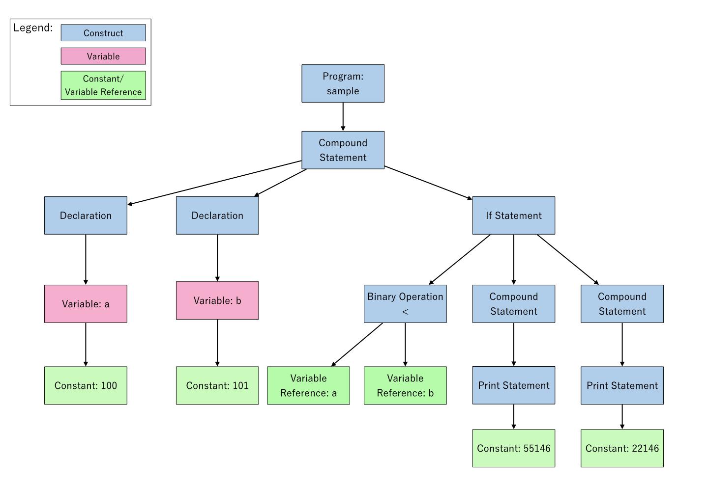

# Project Assignment 3 - Constructing Abstract Syntax Trees

**Introduction to Compiler Design by Prof. Yi-Ping You**

### Due Date:

|group| due date |
|:-:|:-:|
|inservice-student|**23:59, May 20, 2020**|
|master-student|**23:59, May 22, 2020**|

---

**Table of Contents**
- [Project Assignment 3 - Constructing Abstract Syntax Trees](#project-assignment-3---constructing-abstract-syntax-trees)
  - [Overview](#overview)
  - [Assignment Description](#assignment-description)
    - [0x00. Introduction to Abstract Syntax Tree](#0x00-introduction-to-abstract-syntax-tree)
    - [0x01. Preparation for AST Construction](#0x01-preparation-for-ast-construction)
    - [0x02. AST Construction](#0x02-ast-construction)
    - [0x03. AST Examination](#0x03-ast-examination)
  - [Implementation Hints](#implementation-hints)
    - [Location Information](#location-information)
    - [Cyclic Dependency](#cyclic-dependency)
    - [C++ Unions](#c-unions)
    - [%code Directive](#code-directive)
  - [What Should Your Parser Do?](#what-should-your-parser-do)
  - [Project Structure](#project-structure)
  - [Assessment Rubrics (Grading)](#assessment-rubrics-grading)
  - [Build and Execute](#build-and-execute)
    - [Build Project](#build-project)
    - [Test your parser](#test-your-parser)
  - [Submitting the Assignment](#submitting-the-assignment)

---

## Overview

In this assignment, you will extend your parser to construct an abstract syntax tree (AST) for a given program written in **`P`** language using the information provided by previous assignments and to dump this AST in the designated format using visitor pattern.

This assignment will allow later assignments to analyze the program more easily by designing feasible data structures for AST. **DO NOT use string for everything, unless you're obsessed with parsing strings for extracting information from them.**

## Assignment Description

The purpose of this assignment is to get you acquainted with AST. In particular, it will give you familiarity with data structures, types, and code organization you will need to implement AST construction; moreover, you will have a bit grasp of visitor pattern. It's your call to develop this assignment in either `C` or `C++`. However, C++ is recommended because you can make use of the containers defined in the C++ Standard Template Library (STL).

> :warning: **Warning! Read Carefully.**
>
> - Debugging C++ code is a bit tricky. Please make sure you have basic understanding of C++ object oriented, otherwise using C may be a better option.
> - In this assignment, we will use `flex` and `bison`, powerful alternatives of lex and yacc respectively, to compile your codes. Make sure you use the right tools if you won't develop your assignment with the Makefile we provide on CSCC workstation or our docker image.

### 0x00. Introduction to Abstract Syntax Tree

In the previous assignment, we have recognized the structure of the input program, and then we need to perform further tasks, such as semantic analysis, code generation, based on it in the latter assignments. However, writing YACC actions for all the tasks makes your codes gnarly and inflexible.
Therefore, we need some data structure to record the essential information along with the structure of the input program. After that, we can perform those tasks on that data structure individually.

An Abstract Syntax Tree (AST) is a way of representing the syntax of a programming language as a hierarchical tree-like structure. The tree represents all of the constructs in the language and their subsequent rules. Some language constructs, such as if-else conditional and function declaration in `P` language, are made up of simpler constructs, such as variables and statements.

Consequently, the root of an AST of a program represents the entire program, and each node within the AST either has one or more children that represent its constituent parts or represents a basic construct (e.g., a constant or a variable reference) per se.

Let's look at a simple example:

```pascal
sample;

begin
  var a: 100;
  var b: 101;
  if a < b then
  begin
    print 55146;
  end
  else
  begin
    print 22146;
  end
  end if
end
end
```

First, we have a `ProgramNode` as the root of our AST. The `ProgramNode` has an arbitrary number of child nodes, which can be a global (constant) variable declaration, a function declaration, or a program body, and each declaration forms a node. In this case, no declaration is made before the program body, so no declaration node is generated. The `ProgramNode` here has only one child node, which is a program body.

A program body is a `CompoundStatementNode` with an arbitrary number of child nodes:

- Local (constant) variable declarations
	- `var a: 100;`
	- `var b: 101;`
- Statement
	- `if ... else ... end if`

An `if` statement also has an arbitrary number of child nodes. In this case, it has the following child nodes:

- A conditional expression
	- `a < b`
- A compound statement as the if body
	- `begin ... end`
	- A statement in the if body
		- `print 55146;`
- A component statement as the else body
	- `begin ... end`
	- A statement in the else body
		- `print 22146;`

Each of these child nodes can be broken down further. For example, the conditional expression is a `BinaryOperatorNode` of `<` operation with two child nodes:

- A variable reference (left operand)
	- `a`
- A variable reference (right operand)
	- `b`

Here is the full AST for the aforementioned `P` program:



And here's pseudocode for constructing an `IfNode` which is a subtree of the full AST:

```
// Construct if condition
conditional = BinaryOperatorNode(op=">", left_operand=VariableReferenceNode("a")
                                       , right_operand=VariableReferenceNode("b"))

// Construct if body
print = PrintNode(ConstantValueNode(55146))
compound = CompoundStatementNode([print])
if_body = compound

// Construct else body
print = PrintNode(ConstantValueNode(22146))
compound = CompoundStatementNode([print])
else_body = compound

// Construct if statement
if = IfNode(cond=conditional, body=if_body, else=else_body)
```

As you can see, AST can do exactly what we want, recording the essential information like the conditional expression of an `if` statement along with the structure (conditional expression as a child node of an `IfNode`). You're going to design and construct an AST for each given input program in this assignment.

---

### 0x01. Preparation for AST Construction

> Before starting this section, you're recommended to read the lecture note of `Yacc`, in particular, pages 10, 15 and 16.

Now we have a basic grasp of what AST is and what it's capable of. Let's get ready for AST construction with the help of the scanner and the parser we built in the previous assignments.

In the previous section, we may find that two key components of an AST are **the relationship between different nodes** and **the attributes of each node**. We will start with the relationship first.

In effect, the information of the relationship has been captured in the yacc rules written in the previous assignment. All we need is to preserve this relationship in our AST. Take the `print` statement for example:

```
print:
  PRINT Expression SEMICOLON
;

Expression:
    LiteralConstant
    |
    ...
;

LiteralConstant:
    INT_LITERAL
    |
    ...
;
```

Assume that both a `print` statement and a `literal constant` form a node in the AST, you can see that **a `PrintNode` "has" a ConstantValueNode.** We preserve this [**has-a** relationship](https://en.wikipedia.org/wiki/Has-a) through the appropriate design of class `PrintNode`. We'll talk about it in the next section.

---

Next, we also need to store related attribute information when preserving the relationship in the AST. For example:

```
print 55146;
```

Given the code above to our compiler, the scanner tokenizes the string into a series of tokens and then the parser recognizes them as a `print` statement.

After that, we need to extract more information from them for making our AST more expressive. In this case, we extract constant value - 55146 from the string "55146" and the `ConstantValueNode` captures that value as its member. This allows later phases of the compiler (e.g., semantic analysis) to know what the printed value is.

In order to provide the attribute information when performing AST construction, it is variable `yylval`'s turn to play. We may have a regular expression for the decimal integer in `scanner.l`:

```lex
0|[1-9][0-9]*
```

And we add the codes for storing the attribute information in the corresponding lex action:

```lex
0|[1-9][0-9]* {
    yylval = strtol(yytext, NULL, 10);
    return INT_LITERAL;
}
```

Then in the routines of `yyparse()`, when it calls `yylex()` to get a token from a lexical analyzer and it recognizes an integer, the value of that recognized integer is assigned to variable `yylval`. We can then obtain that value in a YACC action through the pseudo-variable $1, $2, and so on.
Furthermore, the semantic values of the non-terminal components of the rule are also referred to the pseudo-variables, but some declarations need to be done before using them. We'll talk about it in the next section.

```
print:
    PRINT Expression SEMICOLON {
        // $2 represents the node constructed in the action of rule LiteralConstant -> INT_LITERAL
        $$ = PrintNode($2);
    }

Expression:
    LiteralConstant {
        $$ = $1;
    }
    |
    ...
LiteralConstant:
    INT_LITERAL {
        // store the recognized value
        $$ = ConstantValueNode(/* type */, /* value */ $1);
    }
    |
    ...
;
;
```

> You may see [this](http://dinosaur.compilertools.net/yacc/index.html) for the internal mechanism of how YACC preserves multiple values set by different lex actions. (Search for "yylval")

However, not all attributes are type integer. Here we can use the `%union` declaration to specify the entire collections of possible data types for semantic values stored in variable `yylval`. (More details can be found in lecture note of Yacc p.16 or [here](https://www.gnu.org/software/bison/manual/bison.html#Union-Decl).)

---

### 0x02. AST Construction

Let's build the AST!

First, we need to define the data structure of each node in the AST. We have to take a look at the requirements of each node so that we can determine how to design each class.

Take `ProgramNode`, `PrintNode` and `ConstantValueNode` for example:

- `ProgramNode`
	- Location
	- Name
	- Return type
	- ...
- `PrintNode`
    - Location
    - Target (an expression node)
- `ConstantValueNode`
	- Location
	- Constant value

> Specific requirements for each kind of node can be found in [AST-guideline.md](./ast_guideline.md).

You may notice that each kind of node has one common attribute - location. As a result, we can extract this common attribute from each kind of node and use inheritance rather than define it in each of them. After that, extend the derived class according to respective requirements if needed.

> More details about location information can be found in Section [Location Information](#location-information)

Initially, define a base class/struct called `AstNode` that other classes/structs will inherit from:

```c++
struct Location {
    uint32_t line;
    uint32_t col;
};

// C++ version
class AstNode {
  public:
    AstNode(const uint32_t line, const uint32_t col);

  public:
    Location location;
};

// C version
struct AstNode {
    struct Location location;
};
```

Then define the derived classes/structs `ProgramNode`, `PrintNode` and `ConstantValueNode`:

```c++
// C++ version
class ProgramNode : public AstNode {
  public:
    ProgramNode(const uint32_t line, const uint32_t col, const char *name);

  public:
    std::string name;
    // TODO: return type, ...
};

class PrintNode : public AstNode {
  public:
    PrintNode(const uint32_t line, const uint32_t col, AstNode *target);

  public:
    AstNode *target;
};

class ConstantValueNode : public AstNode {
  public:
    ConstantValueNode(const uint32_t line, const uint32_t col, const ConstantValue value);

  public:
    ConstantValue value;
};

// C version
struct ProgramNode {
    struct AstNode base;

    const char *name;
    // TODO: return type, ...
};

ProgramNode *newProgramNode(const uint32_t line, const uint32_t col, const char *name);

struct PrintNode {
  struct AstNode base;

  struct AstNode *target;
};

PrintNode *newPrintNode(const uint32_t line, const uint32_t col, AstNode *target);

struct ConstantValueNode {
    struct AstNode base;

    ConstantValue value;
};

ConstantValueNode *newConstantValueNode(const uint32_t line, const uint32_t col,
                                        ConstantValue value);

```

> The C++ code above only shows the rough design of the class. There is a lot more need to be done when using inheritance in C++. You're encouraged to delve into them for having a better quality of code.
>
> If you want to learn more about OOP in C, you can see [你所不知道的 C 語言：物件導向程式設計篇](https://hackmd.io/@sysprog/c-oop?type=view).

Note that a `PrintNode` should have an expression node, which can be a node of type `ConstantValueNode`, `VariableReferenceNode`, etc. Since a member can only be one type, we take advantage of the "is-a" relationship based on inheritance. This relationship allows us to treat a pointer to `ConstantValueNode` as a pointer to `AstNode` in C++ (google "C++ upcasting"), while you can also achieve this in C, but you need to take care of memory layout on your own. In this way, we successfully preserve the has-a relationship mentioned in the previous section.

After defining the data structure of nodes, we can construct the AST through writing yacc actions. (You don't have to finish all the definitions first. You can construct the AST while defining the data structure.) Take the `ProgramNode` as an example:

```yacc
Program:
    ProgramName SEMICOLON
    /* ProgramBody */
    DeclarationList FunctionList CompoundStatement
    /* End of ProgramBody */
    END
;

ProgramName:
    ID
;
```

In the rule of `Program`, there is a non-terminal `ProgramName`. We have to declare a type for it so that yacc/bison can replace the pseudo-variable with the correct member name of `union` (See [3.7.4 Nonterminal Symbols](https://www.gnu.org/software/bison/manual/bison.html#Symbol-Decls)). If you don't declare types for non-terminals, you may get the following error message:

```
parser.y:82.64-65: error: $1 of ‘Program’ has no declared type
```

Non-terminal `ProgramName` should have a semantic value that represents the program name. Therefore, we may have a member which is a pointer to `char` in the union declaration, and use the `%type` declaration to declare a type for `ProgramName`, like this:

```yacc
%union {
    char *identifier;
}

%type <identifier> ProgramName
```

Next, just like the previous section mentioned, we have to add the codes for storing the attribute information in the corresponding lex action. In this case, find the regular expression for the identifier and write some codes like below:

```lex
    /* Identifier */
[a-zA-Z][a-zA-Z0-9]* {
    TOKEN_STRING(id, yytext);
    yylval.identifier = strndup(yytext, /* MAX_ID_LENG */ 32u);
    return ID;
}
```

After that, you can write the yacc action to construct a `ProgramNode` which only has a location and a name as the member of `AstNode` and `ProgramNode` respectively:

```yacc
Program:
    ProgramName SEMICOLON
    /* ProgramBody */
    DeclarationList FunctionList CompoundStatement
    /* End of ProgramBody */
    END {
        // C++ version
        root = new ProgramNode(@1.first_line, @1.first_column, $1 /* TODO: other members */);

        // C version
        root = newProgramNode(@1.first_line, @1.first_column, $1 /* TODO: other members */);
    }
;
```

As for the remaining members of the `ProgramNode` and other nodes, they are left for you to design and implement.

> :warning: **Warning again! Read Carefully.**
>
> - You may need to find a way to convey the type of `P` language. **DO NOT** use string for it. It might be a really simple and straightforward approach in this assignment, but it will be really annoying to deal with it when you need to extract some information from it.
> <br> Here is a suggestion: Use an `enum` and a list of integer for the scalar part and the structured part of type respectively.

---

### 0x03. AST Examination

Writing a big bunch of codes and then compile and test the result is often a non-stop ticket to late-night debugging hell, so it's important to **test your codes step by step when developing**.

For example, in the previous section, we have designed and implemented partial `AstNode` and `ProgramNode`. Thus we can test whether the construction is correct before moving on to the next one.

But how do we test it? Writing unit tests may be a good approach, but it's a bit out of scope (you can still do this if you want). Another approach may be using GDB to examine whether the data on the memory is as expected. However, it's still not practical. Here comes the most fundamental but familiar approach, the almighty `print`! Moreover, it happens to be one of the requirements for this assignment. Let's do this.

In order to dump the information of nodes, we have to consider two things:

1. Traversal
2. Output

In this assignment, we apply a **pre-order** traversal. When traversing nodes, we have to make different kinds of nodes dump their attributes in the corresponding format. Take `PrintNode` for example, it has a member which type is a pointer to `AstNode`. We need to let it output as it is a pointer to `ConstantValueNode` if that node represents statement `print 55146;`, and polymorphism is suitable for this scene.

The concept of polymorphism, in particular subtype polymorphism, is that "a call to a member function will cause a different function to be executed depending on the real type of object that invokes the function".
For example, let class/struct `AstNode` be a base class/struct, and there is a virtual member function `print` (you can use function pointer to achieve the same effect in C). Derived classes/structs (e.g., `ProgramNode`, `DeclarationNode`) then define their own implementation for member function `print`.

Consequently, the program can act like the C++ program below:

> Here only shows C++ codes, since it is simpler than C to illustrate the concept of polymorphism. As for C, you may see this [article](https://www.codeproject.com/Articles/108830/Inheritance-and-Polymorphism-in-C) and feel free to ask questions by opening issues in the Discussion repository.

```c++
// In ast.hpp
class AstNode {
  public:
    // other member functions

    virtual void print() = 0; // pure virtual function

  public:
    // data members
};

// In program.hpp
class ProgramNode : public AstNode {
  public:
    // other member functions

    void print() override;

  public:
    // data members
};

// In program.cpp
void ProgramNode::print() {
  std::printf("program <line: %u, col: %u> %s %s\n",
              location.line, location.col, name.c_str(), "void");
}

// In assignment.hpp
// basically same as program.hpp, omit it.

// In assignment.cpp
void AssignmentNode::print() {
  std::printf("assignment statement <line: %u, col: %u>\n");
}

// In main.cpp
ProgramNode *pn = new ProgramNode(/* ... */);
AssignmentNode *an = new AssignmentNode(/* ... */);

std::vector <AstNode *> nodes = {pn, an};

for (const AstNode *node : nodes) {
  node->print();
}

/*
Output:

program <line: 1, col: 1> test void
assignment statement <line: 15, col: 7>

*/
```

> If you're interested in the mechanism of the virtual function, you may want to know more about [vtable](https://www.learncpp.com/cpp-tutorial/125-the-virtual-table/).

With the help of polymorphism, we can make each node output in the right way when traversing.

As for when to dump the AST, since you will have a root node to represent the whole AST, you may dump it right after the execution of `yyparse()`:

```c++
int main(int argc, const char *argv[]) {
  // ...

  yyparse();

  root->print();

  // ...
}
```

So, here may be your workflow of developing:

1. Design and implement one kind of node partially or fully.
2. Write lex and yacc actions to construct the node.
3. Examine the construction by dumping that node.
4. Repeat 1 ~ 3. until all kinds of nodes have been done.

Now, you should have a basic idea of how to accomplish this assignment. However, we encourage you to read the [tutorial of visitor pattern](./tutorial/) and apply this pattern in your assignment rather than just using polymorphism.

## Implementation Hints

### Location Information

> To use the following feature, you should use `bison` instead of `yacc`. You can use `bison` on the Linux workstation provided by Computer Center, Department of Computer Science, NCTU or our docker image.

`Bison` provides a way to keep track of the textual locations of tokens and groupings. The way locations are handled in `bison` is defined by providing a data type, and actions to take when rules are matched.

**1. Data Type of Locations in `bison`**

You can specify the type of locations by defining a macro called `YYLTYPE`. When `YYLTYPE` is not defined, `bison` uses a default structure type with four members:

```c
typedef struct YYLTYPE {
    int first_line;
    int first_column;
    int last_line;
    int last_column;
} YYLTYPE;
```

You can define your own `YYLTYPE` by defining the macro `YYLTYPE` and the data structure corresponding to it:

```c
#define YYLTYPE yyltype

typedef struct YYLTYPE {
    uint32_t first_line;
    uint32_t first_column;
    uint32_t last_line;
    uint32_t last_column;
} yyltype;
```

For a minimum modification, you should keep the member name unchanged; otherwise, you will also need to fix the macro `YYLLOC_DEFAULT` in your `bison` file. (For more information, see [link 1](https://www.gnu.org/software/bison/manual/html_node/Location-Default-Action.html#Location-Default-Action) and [link 2](https://stackoverflow.com/questions/25258325/lex-yacc-get-current-position).)

**2. Actions for Setting Locations**

Before providing action in your `lex` file, you have to put `%locations` in your `yacc` file, so that `bison` can generate the header with the extern variable `yylloc` for further usage.

You should then provide an action to set the location of each token by defining the macro `YY_USER_ACTION` in `lex`. It is always executed before the action of the matched token rule.

Here is the definition of the macro `YY_USER_ACTION`:

```c
#define YY_USER_ACTION \
    yylloc.first_line = line_num; \
    yylloc.first_column = col_num; \
    col_num += yyleng;
```

`yylloc` is a global variable that is declared and used by `bison`.
The data type of `yylloc` is `YYLTYPE`. We set the `yylloc` each time a token is matched, and then `bison` will store it in an internal array, which can be referred to in a grammar action.

**3. Actions for Getting Locations**

You can get the location (set by `YY_USER_ACTION`) using `@n`, which means the location of the *nth* component of the right-hand side of a production rule.

Here is an example of getting locations:

```yacc
Program:
    ProgramName SEMICOLON ProgramBody END {
        // Use @1 and @5 to get the location of
        // program name and the name after `end`
        root = newProgramNode(@1.first_line, @1.first_column, ...);
    }
;
```

### Cyclic Dependency

If you encounter the problem of cyclic dependency, you may need to learn how to use the forward declaration to handle it. Here is one reference for you. [Forward Declaration in C++](https://www.developingthefuture.net/forward-declarations-in-c/)

### C++ Unions

According to the manual of Bison, if you would like to use C++ in Bison, you're encouraged to use C++ variants for semantic values instead of unions. However, it's a bit complicated to rewrite `parser.y` in full C++ version, we prefer to just use unions for this assignment. After all, the point is to design and construct the AST.

There is a restriction on using unions in C++. Non POD (Plain Old Data) types cannot be used. A POD type is a C++ type that has an equivalent in C, and that uses the same rules as C uses for initialization, copying, layout, and addressing. (see [C++ FAQ](http://www.cs.technion.ac.il/users/yechiel/c++-faq/pod-types.html) for more details)

In short, you cannot declare an object like `std::vector` in `%union`. You should use a pointer to `std::vector` instead. Note that containers in STL and node classes for AST are basically not able to be used in `%union` directly, remember to use the pointer.

### %code Directive

The `%code` directive is used to insert C/C++ code verbatim into the output parser source generated by Bison. In this assignment, we need to use one of the directives - `requires` to write the dependency code required for YYLTYPE.

For example, if you need class `ProgramNode` in the `%union`, you have to use forward declaration or #include directive in the block of `%code requires`. The location of `%code requires` should be before the `%union`. (see [%code summary](https://www.gnu.org/software/bison/manual/html_node/_0025code-Summary.html) for more details)

```
%code requires {
    #include "AST/program.hpp"
}

%union {
    // other members

    ProgramNode *program_node;
};
```

## What Should Your Parser Do?

Your parser should construct an AST, rooted at a Program node, after the execution of `yyparse()`. After that, you can dump the AST, perform semantic analyses or generate code directly upon the AST, rather than completing all the functionalities in the yacc actions.

Your parser should dump the AST when the flag `--dump-ast` is enabled. Use **pre-order traversal** while traversing your AST.

Let's look at a simple example:

```
$ ./parser test.p --dump-ast
1: //&T-
2: test;
3:
4: func( a: integer ; b: array 1 of array 2 of real ): boolean
5: begin
6:   var c: "hello world!";
7:   begin
8:     var d: real;
9:     return (b[1][4] >= 1.0);
10:   end
11: end
12: end
13:
14: begin
15:   var a: integer;
16:   begin
17:     var a: boolean;
18:   end
19: end
20: end
program <line: 2, col: 1> test void
  function declaration <line: 4, col: 1> func boolean (integer, real [1][2])
    declaration <line: 4, col: 7>
      variable <line: 4, col: 7> a integer
    declaration <line: 4, col: 20>
      variable <line: 4, col: 20> b real [1][2]
    compound statement <line: 5, col: 1>
      declaration <line: 6, col: 3>
        variable <line: 6, col: 7> c string
          constant <line: 6, col: 10> hello world!
      compound statement <line: 7, col: 3>
        declaration <line: 8, col: 5>
          variable <line: 8, col: 9> d real
        return statement <line: 9, col: 5>
          binary operator <line: 9, col: 21> >=
            variable reference <line: 9, col: 13> b
              constant <line: 9, col: 15> 1
              constant <line: 9, col: 18> 4
            constant <line: 9, col: 24> 1.000000
  compound statement <line: 14, col: 1>
    declaration <line: 15, col: 3>
      variable <line: 15, col: 7> a integer
    compound statement <line: 16, col: 3>
      declaration <line: 17, col: 5>
        variable <line: 17, col: 9> a boolean

|--------------------------------|
|  There is no syntactic error!  |
|--------------------------------|
```

## Project Structure

- `README.md`
- /src (default starter code in C++)
	- Makefile
	- Makefile-vp - Use this if you choose to use visitor pattern
	- `scanner.l`
	- `parser.y`
	- /include
		- /AST
			- Headers of AST nodes
			- AstDumper.hpp - for dumping AST in visitor pattern version
		- /visitor
			- AstNodeVisitor.hpp - base class for AST visitor
	- /lib
		- /AST
			- Definitions of AST nodes
			- AstDumper.cpp - for dumping AST in visitor pattern version
		- /visitor
			- AstNodeVisitor.cpp
	- Other modules you may add
- tmpl/src-c
	- C version of /src
- tmpl/src-cpp
	- Same as /src
- /report
	- `README.md`

In this assignment, you have to do the following tasks:

- Revise `scanner.l`, `parser.y`, add some modules (e.g., `ast.h`, `ast.c`, etc.) to construct your AST.
- Write the report in `report/README.md`. The report should at least describe the changes you have made in `scanner.l`, `parser.y`, and the abilities of your AST.

If you want to preview your report in GitHub style markdown before pushing to GitHub, [`grip`](https://github.com/joeyespo/grip) might be the tool you need.

## Assessment Rubrics (Grading)

Total of 100 points, with 10 point available bonus points.
(110 pts is the maximum grade you could get in this assignment)

+ Passing all test cases (95 pts)
+ Report (5 pts)
+ bonus
  + using `Visitor Pattern` to dump your AST (6 pts) 
  + describe how visitor pattern works in your project (4 pts)

Be careful, you will get a **50-percent** deduction if you pass **any of** our test cases without constructing an AST. 
> 分數直接砍半哦，歹路毋通行 :heart:

## Build and Execute

- Get Hw3 docker image: `make docker-pull`
- Activate docker environment: `./activate_docker.sh`
- Build: `make`
- Execute: `./parser [input file] --dump-ast`
- Test: `make test`

### Build Project

TA would use `src/Makefile` to build your project by simply typing `make clean && make` on CS workstation. You have to make sure that it will generate an executable named '`parser`'. **No further grading will be made if the `make` process fails or the executable '`parser`' is not found.**

### Test your parser

We provide all the test cases in the `test` folder. Simply type `make test` to test your parser. THe grade you got will be shown on the terminal. You can also check `diff.txt` in `test/result` folder to know the `diff` result between the outputs of your parser and the sample solutions.

Please use `student_` as the prefix of your own tests to prevent TAs from overriding your files. For example: `student_identifier_test`.

## Submitting the Assignment

You should push all your commits to the designated repository (hw3-\<Name of your GitHub account\>) under the compiler-f19 GitHub organization by the deadline (given in the very beginning of this assignment description).
At any point, you may save your work and push commits to your repository. You **must** commit your final version to the **master branch**, and we will grade the commit which is last pushed on your master branch. The **push time** of that commit will be your submission time, so you should not push any commits to the master branch after the deadline if you have finished your assignment; otherwise, you will get a late penalty.

Note that the penalty for late homework is **15% per day** (weekends count as 1 day). Late homework will not be accepted after sample codes have been posted.

In addition, homework assignments **must be individual work**. If we detect what we consider to be intentional plagiarism in any assignment, the assignment will receive reduced or, usually, **zero credit**.
