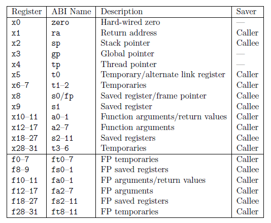
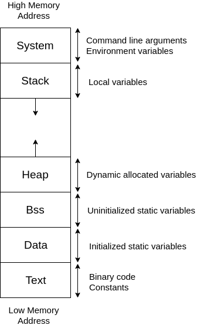
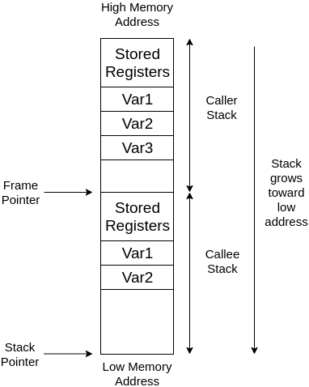
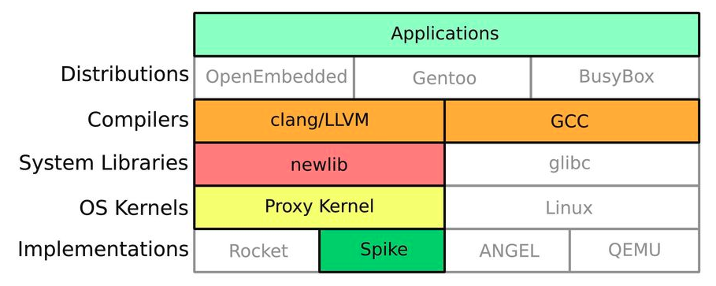

# RISC-V Tutorial

## What is RISC-V

**RISC-V** is an open-source hardware instruction set architecture (ISA) developed by `UC Berkeley`. The goal of RISC-V was to make a practical ISA that was **open-sourced**, usable academically and in any hardware or software design without royalties. RISC-V has a **modular design**, consisting of alternative base parts, with added optional extensions. You can check [RISC-V Doc](https://riscv.org/specifications/) or [Wiki](https://en.wikipedia.org/wiki/RISC-V) for more information. 

## RISC-V Calling Convention and Registers

A **calling convention** is an implementation-level (low-level) scheme for:
 - Where the parameters and return value are placed.
 - The order of parameters placed in registers.
 - What should caller and callee do in the function prologue and epilogue, respectively.

### RISC-V Calling Convention

 - Parameters are placed in registers `a0-7` in the order of the first parameter to the last one.
 - The return value is placed in register `a0`.
 - Caller is responsible for saving and restoring registers `ra`, `t0`-`t6`, and `a0`-`a7`.
 - Callee is responsible for saving and restoring registers `sp` and `s0`-`s11`.
 - Callee is responsible for allocating local memory and clearing local memory.

The following table shows `RISC-V` basic registers, what they are used for, and who is responsible for saving them.

## Memory Allocation

### Memory Layout

 - Initialized global variables are placed in the `data` segment.
 - Uninitialized global variables are placed in the `bss` segment.
 - Global constants are placed in the `text` segment.
 - Local variables and local constants are placed in the `stack` segment.
 - Instructions are placed in the `text` segment.

### Stack Allocation

 - The stack pointer (stored in the `sp` register) points to the top of the current stack.
 - The frame pointer (stored in the `s0` register) points to the bottom of the current stack.
 - To allocate a new stack as local memory, move frame pointer to stack pointer and move stack point to lower address.

## RISC-V Instructions 

In this assignment, we use **`RV32`** 32-bit RISC-V instruction set. Your generated RISC-V instructions will be compiled and run on simulator `Spike`. You can check out [Simulator Instructions](https://github.com/riscv/riscv-isa-sim/tree/master/riscv/insns) to look up instructions that `Spike` implemented.

### Register-Register Computational Instructions
 - add  rd, rs1, rs2 
   - rd = rs1 + rs2
 - sub  rd, rs1, rs2 
   - rd = rs1 - rs2
 - mul  rd, rs1, rs2 
   - rd = rs1 * rs2
 - div  rd, rs1, rs2 
   - rd = rs1 / rs2
 - rem  rd, rs1, rs2 
   - rd = rs1 % rs2

### Register-Immediate Instructions
 - addi rd, rs1, immediate 
   - rd = rs1 + 12-bit immediate
 - li  rd, immediate 
   - load 12-bit immediate value to rd

### Register-Register Instructions
 - mv  rd, rs
   - copy from rs to rd

### Load and Store Instructions  
 - sw  rs2, immediate(rs1) 
   - add the memory address stored in rs1 and the immediate value up, then store the value in rs2 to that address
 - lw  rd, immediate(rs1)
   - add the memory address stored in rs1 and the immediate value up, load the value stored in that address, then store to rd
 - la  rd, symbol
   - load memory address of the symbol to rd

### Branch Instructions
 - jal rd, symbol 
   - jump to the symbol and store the return address in rd
   - the `ra` register is used to store the return address
 - jr  rs1
   - jump to the address stored in rs1
 - j symbol
   - jump to the symbol
 - beq rs1, rs2, symbol
   - if rs1 == rs2, jump to the symbol
 - bne rs1, rs2, symbol
   - if rs1 != rs2, jump to the symbol
 - blt rs1, rs2, symbol
   - if rs1 < rs2, jump to the symbol
 - ble rs1, rs2, symbol
   - if rs1 <= rs2, jump to the symbol
 - bgt rs1, rs2, symbol
   - if rs1 > rs2, jump to the symbol
 - bge rs1, rs2, symbol
   - if rs1 >= rs2, jump to the symbol

## RISC-V Simulator Reference

 - [RISC-V GNU Compiler](https://github.com/riscv/riscv-gnu-toolchain)
 - [Spike](https://github.com/riscv/riscv-isa-sim)
 - [Proxy Kernel](https://github.com/riscv/riscv-pk)